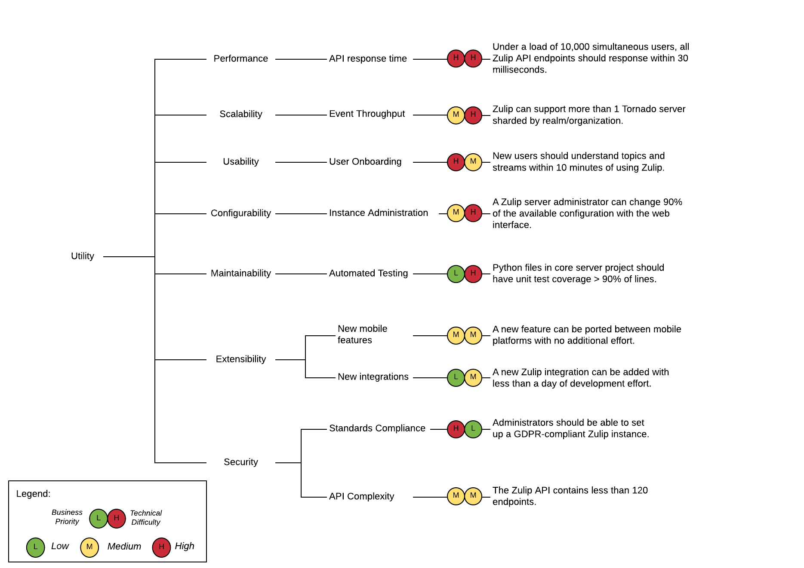
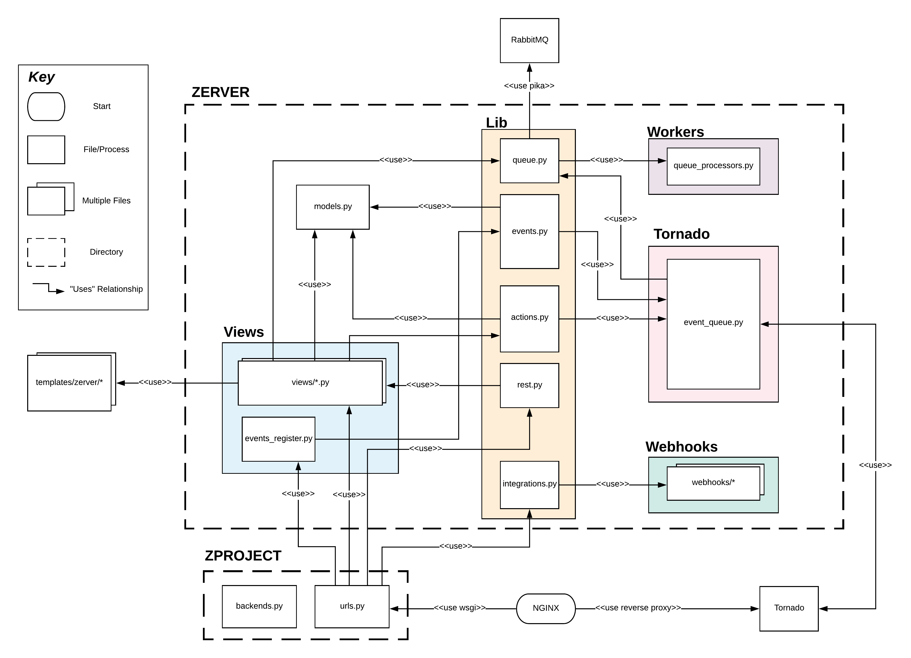
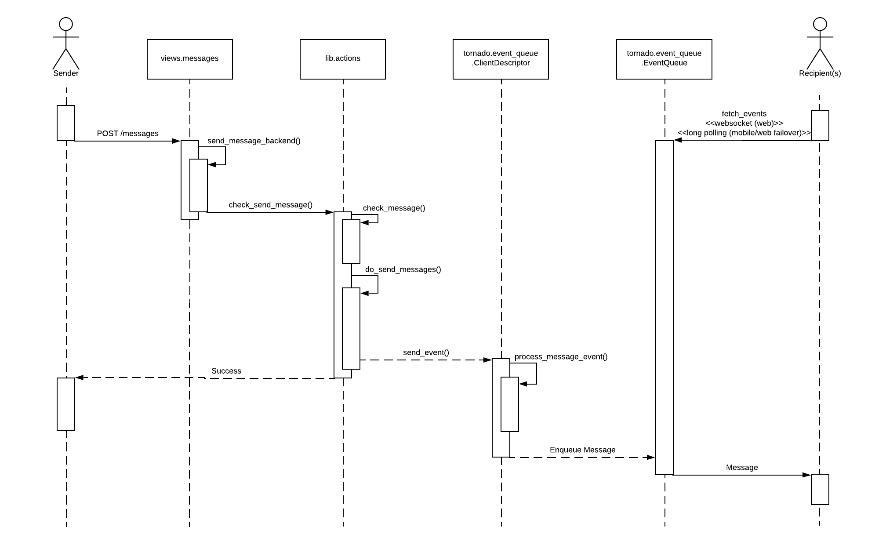

# Zulip  

## Table Of Contents

 1. Purpose
 2. About Zulip
 3. [Stakeholders](#Stakeholders)
 4. Business Goals
 5. Architecturally Significant Requirements (ASR)
 6. Utility Tree
 7. Quality Attribute Scenarios (QAS)
 8. [Module View](#Module-View)
    * [Primary Presentation](#Primary-Presentation)
    * [Element Catalog](#Element-Catalog)
      + Elements and Properties
      + Relations and Properties
    * Context Diagram
    * [Behaviour Diagram](#Behavior-Diagram)
    * Rationale
 9. Component and Connector View
    * Primary Presentation
    * Element Catalog
      + Elements and Properties
      + Relations and Properties
      + Element Behaviour
    * Context Diagram
    * Variability Guide
    * Rationale
 10. Code Quality and Technical Debt
 11. Conclusion

## Team 

## Purpose

## About Zulip

Many Slack users only actively use a fraction of the channels they belong to. This problem becomes more prevalent in positions higher up the company ladder. Having only one channel per team or project often means juggling many topics or conversations at once. This overlap makes asynchronous work difficult as important information is often lost among the mountain of recent messages.

Zulip is a chat application started in 2012 and acquired by Dropbox in 2014. Open-sourced in 2015 under the Apache License, they report to having contributions from approximately 500 people. Boasting apps for all platforms, a unique threading system allowing for superior conversation sorting and searching, and integrations for over 100 services, Zulip is a powerful tool designed specifically for an asynchronous and distributed workforce.

Zulip believes "asynchronous communication is fundamental" to modern work. In order to counter the issues outlined above, Zulip's versions of channels (called Streams) use "Topics" as tags for every message so sorting conversations can be done at a touch. This transforms confusing walls of text into threads that immediately make sense to the user.

## Privacy, Security, and Ethics

#### Introduction

Zulip is used by thousands of teams worldwide to manage internal communications which could contain confidential client information [16]. Due to its wide use, Zulip needs to conform to data privacy standards in many countries. However, this necessity is complicated by the need to retain information for said records in accordance with other laws and company policy demands.

Zulip's ethical position may also be compromised by malicious user groups as their usage could influence Zulip negatively.

#### Potential Privacy and Security Concerns

This section assesses how Zulip currently complies with the ACM Code of Ethics and Professional Conduct with regards to privacy and security [1]. These issues are particularly relevant as this chat application is intended for company use and will be transferring potentially confidential information. Zulip supports compliance with GDPR and HIPAA, which are data privacy standards for the European Union and the United States, respectively.

Zulip provides a fairly concise and transparent account of its data usage procedures [2]. However, the policy fails to adequately describe the policies for data retention and disposal. Whereas the Code of Ethics section 1.6 states that this information "should be clearly defined, enforced, and communicated to data subjects", the privacy policy does not specify how long data is retained. In fact, Zulip states that even after deleting information from Zulip's services, "we may not immediately delete residual copies from our active servers and may not remove information from our backup systems."

In addition, although you may deactivate your account as a user, it is unclear how to have your personal information deleted. The privacy policy only mentions that Zulip will provide ways to delete your information in the case that the information is wrong. Another issue is that your messages and shared files will remain visible even after deactivating your account. The only workaround appears to be manually removing this information before deactivating your account.

Because Zulip allows users to deploy their own server, it is important that the security features of Zulip are simple to use and well-documented. Zulip provides documentation overviewing its security features [3]. To supplement this, there is a Zulip community server providing product support, as well as a Google group for users to report security bugs and receive security updates. In accordance with the Code of Ethics, the Zulip development team seems responsive to security bugs, issuing 3 dedicated security patches out of the last 13 updates [4]. As with other chat apps, a Zulip server may be vulnerable to its users unintentionally exposing data through the misuse of 3rd party integrations, as well as through administrators failing to deactivate old accounts, such as those for ex-employees.

#### Ethical Dilemmas

This section will attempt to analyze potential ethical dilemmas that Zulip will face as an open source project. Since Zulip is a chat application, the vast majority of potential ethical problems stem from privacy and confidentiality issues so that is where we have focused our analysis. 

One potential ethical dilemma that Zulip faces is the potential ability of paying users, corporate or otherwise, to influence the project. Unlike many other open source projects, Zulip offers multiple payment plans for potential users [5] including a standard paid version and, more importantly, an Enterprise payment plan which offers the benefit "Input into the Zulip roadmap." It is possible for this option to influence the direction of the project in a way that disproportionately favours enterprises that heavily fund Zulip. Zulip will need to understand when this is happening and decide whether the funding is valuable enough to outweigh the potential downsides. 

Because Zulip stores the private messages and data of users, provided they are not hosting their own server, there is the potential that incriminating messages will be sent using the platform. This could lead to a situation where Zulip must decide whether or not the chat logs and data will be released to the authorities or if the privacy of the users will be prioritized. This dilemma falls broadly under section 1.6 and 1.7 of the ACM Code of Ethics and Professional Conduct (Respect Privacy and Honor Confidentiality respectively). If Zulip is faced with this choice, they will need to evaluate their stance as a company and set a precedent for all future decisions of this type.

A final issue that Zulip may be faced with in the future is one of free speech. As has been seen on multiple social media platforms in recent years, such as Facebook [6] and Reddit [7] ,the possibility of an individual or group starting a potentially offensive or dangerous group on Zulip is possible. This issue is further clouded by Zulip's allowance of users to host the application off of their own servers. In the future Zulip may have to make case by case decisions on whether or not to allow groups to exist on their application. 

#### Summary

As a service, Zulip contends with many of the same ethical issues of many other large companies: security and integrity of their system, and privacy of their clients. While strong in the security, the latter two aspects still hold concerns for Zulip. A vulnerability to negligent use of 3rd party integrations and the inability for users to remove their personal data with any degree of certainty means there is still a way to go.

Even giant companies like Facebook and Google struggle to toe the line in regards to their ethical responsibilities. For an open source project that could be corrupted with poorly written or malicious additions, makes the responsibility of the owners that much heavier.

## Stakeholders

Zulip is an open-source project, and can be used by anyone, however several stakeholders have a significant influence over the development of the project. Kandra Labs Inc. provides a commercial hosted solution (Zulip Cloud) for Zulip, and is run by Tim Abbott, which gives the company a significant stake in Zulip's development. Open-source contributors to Zulip also use the product regularly, giving them a stake in the project.

Stakeholders for the Zulip project have been assigned to relevant categories from Rozanski and Woods' work [8] below:

* **Assessors:** Kandra Labs, Inc. acts as a GDPR-compliant data subprocessor for Zulip cloud services [9]. As such, they must ensure that Zulip has all the required features to comply with GDPR. 

* **Communicators:** Documentation for Zulip (published on [zulip.readthedocs.io](https://zulip.readthedocs.io/en/latest/)) is maintained alongside the codebase. The open-source community is responsible for contributing changes to the online documentation as pull requests.

  Tim Abbott and Kandra Labs also maintain a blog for Zulip ([blog.zulip.org](http://blog.zulip.org)) and a [Twitter page](https://twitter.com/zulip?lang=en).

* **Developers:** Zulip was initially developed by the members of Zulip, Inc., a small startup led by [Tim Abbott](https://github.com/timabbott) which was acquired by Dropbox in 2014 [10]. After the project was made open-source by Dropbox in 2015, Tim Abbott continued development work with the help of the open-source community.

* **Maintainers:** [Tim Abbott](https://github.com/timabbott) is currently Zulip's most active maintainer. Other members of the core team include [Anders Kaseorg](https://github.com/andersk) and [Rishi Gupta](https://github.com/rishig). Zulip is also maintained by several distributed developers from open-source development programs, most notably [Google Summer of Code](https://summerofcode.withgoogle.com/) and [Google Code-In](https://codein.withgoogle.com/archive/) [10].

* **Production Engineers:** Kandra Labs provisions the infrastructure for Zulip Cloud [11], while members of the open-source community may also deploy on-premise versions of Zulip.

* **Suppliers:** The Zulip project is funded by an SBIR grant from the US National Science Foundation. 

* **Support Staff:** Kandra Labs provides support for Zulip Cloud. For the open-source project, support is provided by Tim Abbott and other members of the open-source community on the [Zulip community server](http://chat.zulip.org). 

* **System Administrators:** Production instances for Zulip Cloud are maintained by Kandra labs. 

* **Testers:** Testing on the Zulip project is done for every pull request. Manual testing of new features is done by PR reviewers (Tim Abbott or another member of the Zulip core team), and regression testing is handled by a suite of automated front-end and back-end tests.

* **Users:** Zulip is used by several corporate and open-source development teams including Akamai, Wikimedia and MariaDB. It is also used by Zulip's own development team to power the [Zulip community server](http://chat.zulip.org). 

## Business Goals

1. The Zulip developers wish for Zulip to be a more effective communication system than Slack, specifically for remote workers. This goal will be satisfied if users of Zulip need to use email and video meetings significantly less [12].
2. The parent corporation of Zulip, Kandra Labs, wants Zulip to turn a profit from its enterprise and standard plans [13].
3. The Zulip developers want Zulip to have an appealing and intuitive visual design that is friendly to new client users or Zulip Server users [14].
4. The Zulip developers want to build out the API, bots, and integrations framework for both the server and client system [15].
5. The Zulip developers want the Zulip server system to scale well to 10,000 users in a realm [3].
6. The Zulip developers want Zulip to be available on all desktop and mobile platforms while minimizing the work needed to maintain multiple code bases [14].

## Utility Tree

## Quality Attribute Scenarios

Server Performance

Aspect|Details
:---|:---
Scenario Name|Server Scalability
Business Goals|Allow for a stable usage experience even under extreme loads
Quality Attribute|Performance
Stimulus|User joins server hosting at least 10,000 simultaneous users
Stimulus Source|Zulip User
Response|Server continues running normally
Response Measure|Messages send to the server, and are received from the server in under 30 milliseconds

Ease of Mobile Code Extensibility

Aspect|Details
:---|:---
Scenario Name|Modify Mobile Client
Business Goals|Allow for easy addition of new features
Quality Attribute|Extensibility
Stimulus|A developer adds a new feature to the Zulip mobile client
Stimulus Source|Zulip Developer
Response|The feature is implemented and the new version of the client is sent out
Response Measure|The feature is ported between mobile platforms without additional effort.

New User Onboarding Process

Aspect|Details
:---|:---
Scenario Name|New User Understands Zulip
Business Goals|New users should be able to understand and use Zulip, including streams and topics, with minimal effort and time spent
Quality Attribute|Usability
Stimulus|User starts using Zulip for the first time
Stimulus Source|New Zulip User
Response|User is proficient at using Zulip, and understands the usage of streams and topics
Response Measure|User can explain the concepts of streams and topics, and can use these features within Zulip

API Performance

Aspect|Details
:---|:---
Scenario Name|API Response Time
Business Goals|Have a high performance API allowing for a responsive user experience and a low latency client
Quality Attribute|Performance
Stimulus|Source requests data from an API endpoint
Stimulus Source|Client or 3rd Party Integration
Response| Server sends response data
Response Measure|Data is received within 30 milliseconds of the request being sent

## Architecturally Significant Requirements:

1. No additional code changes should be required to implement a feature on the Android and iOS mobile applications (see business goal 6).
2. Zulip should support Windows, iOS, Android, Linux, MacOS, web browsers, chat clients, and Zulip API clients with a minimum of code duplication [17].
3. New users should be able to explain the concepts of topics and streams within 10 minutes of using Zulip (business requirement 3).
4. Zulip should have a REST API with less than 120 total endpoints [18].
5. Under load of 10,000 simultaneous users, all Zulip API endpoints should respond in under 30 milliseconds (business requirement 5).
6. Zulip must support real-time sync between server and client [19].
7. Python files in the Zulip server project should have unit test coverage of more than 90% by line [20].
8. Open-source contributors are able to extend the app by submitting new features.
9. Traffic between clients and Zulip should have enterprise-grade security.
10. Zulip should support a wide range of authentication methods including email/password and Google.
11. Zulip should support a range of user types: administrators, members, guests, and bots:

    - Bot users should be able to automate user actions.
    - Guest users should not have access to public streams.
    - Realm administrators should be able to do the majority of realm configuration on the web [21].
12. Zulip should support hosting for user-uploaded files.
13. Zulip should support integration with hundreds of custom webhooks.
14. Zulip should be deployable as both a cloud service and an on-premise solution.
15. Zulip should support GDPR Compliance.
16. Zulip should support searching through message history [22].

# Module View

## Primary Presentation

## Element Catalog

### Elements and Properties
- zproject/backends.py - Configuration for any authentication systems in addition to Django's default system.  
- zproject/urls.py - List of URLs and the Django views they map to.  
- zerver/lib/actions.py - Functions for writing to database tables.  
- zerver/lib/events.py - Functions for fetching server state atomically.  
- zerver/lib/integrations.py - Registry of all integrations.  
- zerver/lib/queue.py - Functions for initializing and pushing to Tornado.  
- zerver/lib/rest.py - Handling for requests to API endpoints.  
- zerver/models.py - Django models.  
- zerver/tornado/event_queue.py - Logic for the real-time push system.  
- zerver/views/\*.py - Django views.  
- zerver/views/events_register.py - Handling for requests that need to be synced with other clients.  
- zerver/webhooks/\* - Webhooks for integrations.  
- zerver/workers/queue_processors.py - Definition for a worker in the RabbitMQ queue.  
- templates/zerver/\* - Django templates using Jinja2.  
- Nginx - Front-end web server that handles all HTTP requests.  
- RabbitMQ - Message broker used to manage a set of queues.  
- Tornado - Asynchronous web server used in conjunction with Django to handle real-time push.  

### Relations and Properties
- wsgi - Web Server Gateway Interface.  
- reverse proxy - Reverse proxy server.  
- pika - Python library for RabbitMQ.  

## Behaviour Diagram

The above diagram details one of Zulip's most performance-critical paths, from the sending of a message by one user to its receipt by one or more other users. The sender sends a message using Zulip's REST API, and receivers are notified using the real-time events system [23]. The procedure is as follows:

* The sender issues a POST request to the `/messages` endpoint.
* Zulip validates the request content and determines the clients who need to receive a notification in `check_message`.
* Zulip enqueues a notification in each of the clients' event queues.
* Tornado pulls the messages off of the event queues and sends them to their clients:
  * Mobile clients receive messages via long polling.
  * Web clients are typically connected via a WebSocket connection, but can also use a long polling approach if WebSockets are not supported.

### References

1. ACM Code of Ethics and Professional Conduct https://www.acm.org/code-of-ethics   
2. Zulip Privacy Policy https://zulipchat.com/privacy/  
3. Zulip Security Model https://zulip.readthedocs.io/en/stable/production/security-model.html  
4. Zulip Release Announcements https://groups.google.com/forum/#%21forum/zulip-announce  
5. Zulip Payment Plans https://zulipchat.com/plans/  
6. Facebook Censorship Article https://globalnews.ca/news/5141557/facebook-bans-extremism-hate-policy/  
7. Reddit Censorship Article https://www.theverge.com/2019/3/15/18267645/reddit-watchpeopledie-ban-new-zealand-mosque-massacre-christchurch  
8. Software Systems Architecture, Rozanski and Woods https://www.viewpoints-and-perspectives.info/home/stakeholders/
9. Zulip Help, GDPR Compliance https://zulipchat.com/help/gdpr-compliance
10. Zulip History https://zulipchat.com/history/
11. Zulip Team https://zulipchat.com/team/
12. Why Zulip https://zulipchat.com/why-zulip/
13. Kandra Labs Incorporation Papers https://icis.corp.delaware.gov/Ecorp/EntitySearch/NameSearch.aspx
14. Zulip Roadmap https://zulip-ck.readthedocs.io/en/latest/roadmap.html
15. Zulip Roadmap https://zulip.readthedocs.io/en/latest/overview/roadmap.html
16. Zulip Homepage https://zulipchat.com/
17. Zulip Tech Stack Decisions https://stackshare.io/tabbott/decisions
18. Zulip Security https://zulipchat.com/security/
19. Zulip Events System https://zulip.readthedocs.io/en/latest/subsystems/events-system.html
20. Zulip Code Review Procedurehttps://zulip.readthedocs.io/en/latest/contributing/code-reviewing.html#zulip-server
21. Zulip Change Guide https://zulip.readthedocs.io/en/latest/production/settings.html#making-changes
22. Zulip User and Bots Security https://zulip.readthedocs.io/en/latest/production/security-model.html#users-and-bots
23. Zulip Sending Messages https://zulip.readthedocs.io/en/latest/subsystems/sending-messages.html
