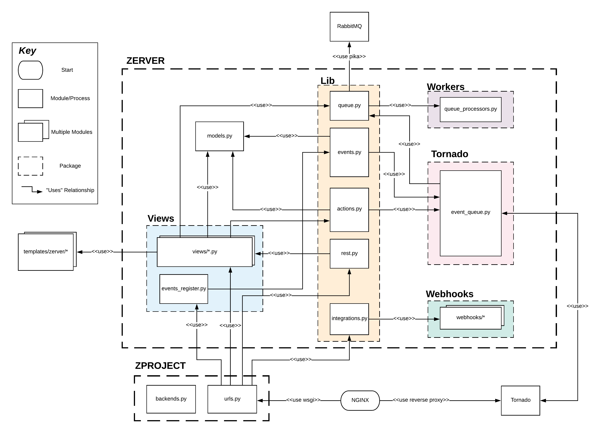
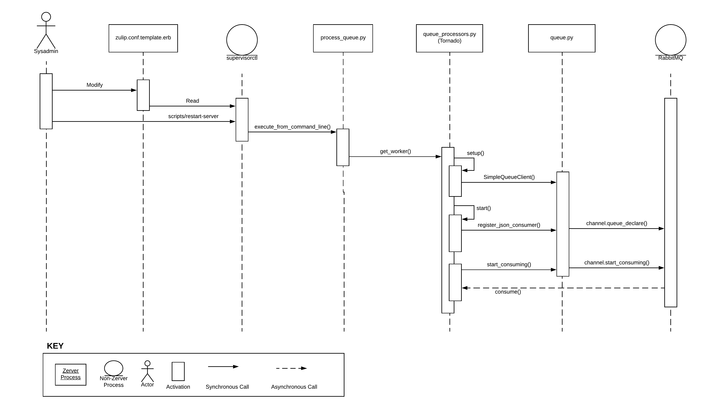

# Zulip  

## Table Of Contents

 1. Purpose
 2. About Zulip
 3. [Stakeholders](#Stakeholders)
 4. Business Goals
 5. Architecturally Significant Requirements (ASR)
 6. Utility Tree
 7. Quality Attribute Scenarios (QAS)
 8. [Module View](#Module-View)
    * [Primary Presentation](#Primary-Presentation)
    * [Element Catalog](#Element-Catalog)
      + Elements and Properties
      + Relations and Properties
    * [Context Diagram](#Context-Diagram)
    * [Behaviour Diagram](#Behaviour-Diagram)
    * [Interfaces](#Interfaces)
    * [Module Rationale](#Module-Rationale)
 9. [Component and Connector View](#Component-and-Connector-View)
    * Primary Presentation
    * Element Catalog
      + Elements and Properties
      + Relations and Properties
      + Element Behaviour
    * Context Diagram
    * Behaviour Diagram
    * [Variability Guide](#Variability-Guide)
    * [Component and Connector Interfaces](#Component and Connector Interfaces)
    * [Component and Connector Rationale](#Component and Connector Rationale)
 10. Code Quality and Technical Debt
 11. Conclusion

## Team 

## Purpose

## About Zulip

Many Slack users only actively use a fraction of the channels they belong to. This problem becomes more prevalent in positions higher up the company ladder. Having only one channel per team or project often means juggling many topics or conversations at once. This overlap makes asynchronous work difficult as important information is often lost among the mountain of recent messages.

Zulip is a chat application started in 2012 and acquired by Dropbox in 2014. Open-sourced in 2015 under the Apache License, they report to having contributions from approximately 500 people. Boasting apps for all platforms, a unique threading system allowing for superior conversation sorting and searching, and integrations for over 100 services, Zulip is a powerful tool designed specifically for an asynchronous and distributed workforce.

Zulip believes "asynchronous communication is fundamental" to modern work. In order to counter the issues outlined above, Zulip's versions of channels (called Streams) use "Topics" as tags for every message so sorting conversations can be done at a touch. This transforms confusing walls of text into threads that immediately make sense to the user.

## Privacy, Security, and Ethics

#### Introduction

Zulip is used by thousands of teams worldwide to manage internal communications which could contain confidential client information [16]. Due to its wide use, Zulip needs to conform to data privacy standards in many countries. However, this necessity is complicated by the need to retain information for said records in accordance with other laws and company policy demands.

Zulip's ethical position may also be compromised by malicious user groups as their usage could influence Zulip negatively.

#### Potential Privacy and Security Concerns

This section assesses how Zulip currently complies with the ACM Code of Ethics and Professional Conduct with regards to privacy and security [1]. These issues are particularly relevant as this chat application is intended for company use and will be transferring potentially confidential information. Zulip supports compliance with GDPR and HIPAA, which are data privacy standards for the European Union and the United States, respectively.

Zulip provides a fairly concise and transparent account of its data usage procedures [2]. However, the policy fails to adequately describe the policies for data retention and disposal. Whereas the Code of Ethics section 1.6 states that this information "should be clearly defined, enforced, and communicated to data subjects", the privacy policy does not specify how long data is retained. In fact, Zulip states that even after deleting information from Zulip's services, "we may not immediately delete residual copies from our active servers and may not remove information from our backup systems."

In addition, although you may deactivate your account as a user, it is unclear how to have your personal information deleted. The privacy policy only mentions that Zulip will provide ways to delete your information in the case that the information is wrong. Another issue is that your messages and shared files will remain visible even after deactivating your account. The only workaround appears to be manually removing this information before deactivating your account.

Because Zulip allows users to deploy their own server, it is important that the security features of Zulip are simple to use and well-documented. Zulip provides documentation overviewing its security features [3]. To supplement this, there is a Zulip community server providing product support, as well as a Google group for users to report security bugs and receive security updates. In accordance with the Code of Ethics, the Zulip development team seems responsive to security bugs, issuing 3 dedicated security patches out of the last 13 updates [4]. As with other chat apps, a Zulip server may be vulnerable to its users unintentionally exposing data through the misuse of 3rd party integrations, as well as through administrators failing to deactivate old accounts, such as those for ex-employees.

#### Ethical Dilemmas

This section will attempt to analyze potential ethical dilemmas that Zulip will face as an open source project. Since Zulip is a chat application, the vast majority of potential ethical problems stem from privacy and confidentiality issues so that is where we have focused our analysis. 

One potential ethical dilemma that Zulip faces is the potential ability of paying users, corporate or otherwise, to influence the project. Unlike many other open source projects, Zulip offers multiple payment plans for potential users [5] including a standard paid version and, more importantly, an Enterprise payment plan which offers the benefit "Input into the Zulip roadmap." It is possible for this option to influence the direction of the project in a way that disproportionately favours enterprises that heavily fund Zulip. Zulip will need to understand when this is happening and decide whether the funding is valuable enough to outweigh the potential downsides. 

Because Zulip stores the private messages and data of users, provided they are not hosting their own server, there is the potential that incriminating messages will be sent using the platform. This could lead to a situation where Zulip must decide whether or not the chat logs and data will be released to the authorities or if the privacy of the users will be prioritized. This dilemma falls broadly under section 1.6 and 1.7 of the ACM Code of Ethics and Professional Conduct (Respect Privacy and Honor Confidentiality respectively). If Zulip is faced with this choice, they will need to evaluate their stance as a company and set a precedent for all future decisions of this type.

A final issue that Zulip may be faced with in the future is one of free speech. As has been seen on multiple social media platforms in recent years, such as Facebook [6] and Reddit [7] ,the possibility of an individual or group starting a potentially offensive or dangerous group on Zulip is possible. This issue is further clouded by Zulip's allowance of users to host the application off of their own servers. In the future Zulip may have to make case by case decisions on whether or not to allow groups to exist on their application. 

#### Summary

As a service, Zulip contends with many of the same ethical issues of many other large companies: security and integrity of their system, and privacy of their clients. While strong in the security, the latter two aspects still hold concerns for Zulip. A vulnerability to negligent use of 3rd party integrations and the inability for users to remove their personal data with any degree of certainty means there is still a way to go.

Even giant companies like Facebook and Google struggle to toe the line in regards to their ethical responsibilities. For an open source project that could be corrupted with poorly written or malicious additions, makes the responsibility of the owners that much heavier.

## Stakeholders

Zulip is an open-source project, and can be used by anyone, however several stakeholders have a significant influence over the development of the project. Kandra Labs Inc. provides a commercial hosted solution (Zulip Cloud) for Zulip, and is run by Tim Abbott, which gives the company a significant stake in Zulip's development. Open-source contributors to Zulip also use the product regularly, giving them a stake in the project.

Stakeholders for the Zulip project have been assigned to relevant categories from Rozanski and Woods' work [8] below:

* **Assessors:** Kandra Labs, Inc. acts as a GDPR-compliant data subprocessor for Zulip cloud services [9]. As such, they must ensure that Zulip has all the required features to comply with GDPR. 

* **Communicators:** Documentation for Zulip (published on [zulip.readthedocs.io](https://zulip.readthedocs.io/en/latest/)) is maintained alongside the codebase. The open-source community is responsible for contributing changes to the online documentation as pull requests.

  Tim Abbott and Kandra Labs also maintain a blog for Zulip ([blog.zulip.org](http://blog.zulip.org)) and a [Twitter page](https://twitter.com/zulip?lang=en).

* **Developers:** Zulip was initially developed by the members of Zulip, Inc., a small startup led by [Tim Abbott](https://github.com/timabbott) which was acquired by Dropbox in 2014 [10]. After the project was made open-source by Dropbox in 2015, Tim Abbott continued development work with the help of the open-source community.

* **Maintainers:** [Tim Abbott](https://github.com/timabbott) is currently Zulip's most active maintainer. Other members of the core team include [Anders Kaseorg](https://github.com/andersk) and [Rishi Gupta](https://github.com/rishig). Zulip is also maintained by several distributed developers from open-source development programs, most notably [Google Summer of Code](https://summerofcode.withgoogle.com/) and [Google Code-In](https://codein.withgoogle.com/archive/) [10].

* **Production Engineers:** Kandra Labs provisions the infrastructure for Zulip Cloud [11], while members of the open-source community may also deploy on-premise versions of Zulip.

* **Suppliers:** The Zulip project is funded by an SBIR grant from the US National Science Foundation. 

* **Support Staff:** Kandra Labs provides support for Zulip Cloud. For the open-source project, support is provided by Tim Abbott and other members of the open-source community on the [Zulip community server](http://chat.zulip.org). 

* **System Administrators:** Production instances for Zulip Cloud are maintained by Kandra labs. 

* **Testers:** Testing on the Zulip project is done for every pull request. Manual testing of new features is done by PR reviewers (Tim Abbott or another member of the Zulip core team), and regression testing is handled by a suite of automated front-end and back-end tests.

* **Users:** Zulip is used by several corporate and open-source development teams including Akamai, Wikimedia and MariaDB. It is also used by Zulip's own development team to power the [Zulip community server](http://chat.zulip.org). 

## Business Goals

1. The Zulip developers wish for Zulip to be a more effective communication system than Slack, specifically for remote workers. This goal will be satisfied if users of Zulip need to use email and video meetings significantly less [12].
2. The parent corporation of Zulip, Kandra Labs, wants Zulip to turn a profit from its enterprise and standard plans [13].
3. The Zulip developers want Zulip to have an appealing and intuitive visual design that is friendly to new client users or Zulip Server users [14].
4. The Zulip developers want to build out the API, bots, and integrations framework for both the server and client system [15].
5. The Zulip developers want the Zulip server system to scale well to 10,000 users in a realm [3].
6. The Zulip developers want Zulip to be available on all desktop and mobile platforms while minimizing the work needed to maintain multiple code bases [14].

## Utility Tree


## Quality Attribute Scenarios

Server Performance

Aspect|Details
:---|:---
Scenario Name|Server Scalability
Business Goals|Allow for a stable usage experience even under extreme loads
Quality Attribute|Performance
Stimulus|User joins server hosting at least 10,000 simultaneous users
Stimulus Source|Zulip User
Response|Server continues running normally
Response Measure|Messages send to the server, and are received from the server in under 30 milliseconds

Ease of Mobile Code Extensibility

Aspect|Details
:---|:---
Scenario Name|Modify Mobile Client
Business Goals|Allow for easy addition of new features
Quality Attribute|Extensibility
Stimulus|A developer adds a new feature to the Zulip mobile client
Stimulus Source|Zulip Developer
Response|The feature is implemented and the new version of the client is sent out
Response Measure|The feature is ported between mobile platforms without additional effort.

New User Onboarding Process

Aspect|Details
:---|:---
Scenario Name|New User Understands Zulip
Business Goals|New users should be able to understand and use Zulip, including streams and topics, with minimal effort and time spent
Quality Attribute|Usability
Stimulus|User starts using Zulip for the first time
Stimulus Source|New Zulip User
Response|User is proficient at using Zulip, and understands the usage of streams and topics
Response Measure|User can explain the concepts of streams and topics, and can use these features within Zulip

API Performance

Aspect|Details
:---|:---
Scenario Name|API Response Time
Business Goals|Have a high performance API allowing for a responsive user experience and a low latency client
Quality Attribute|Performance
Stimulus|Source requests data from an API endpoint
Stimulus Source|Client or 3rd Party Integration
Response| Server sends response data
Response Measure|Data is received within 30 milliseconds of the request being sent

## Architecturally Significant Requirements:

1. No additional code changes should be required to implement a feature on the Android and iOS mobile applications (see business goal 6).
2. Zulip should support Windows, iOS, Android, Linux, MacOS, web browsers, chat clients, and Zulip API clients with a minimum of code duplication [17].
3. New users should be able to explain the concepts of topics and streams within 10 minutes of using Zulip (business requirement 3).
4. Zulip should have a REST API with less than 120 total endpoints [18].
5. Under load of 10,000 simultaneous users, all Zulip API endpoints should respond in under 30 milliseconds (business requirement 5).
6. Zulip must support real-time sync between server and client [19].
7. Python files in the Zulip server project should have unit test coverage of more than 90% by line [20].
8. Open-source contributors are able to extend the app by submitting new features.
9. Traffic between clients and Zulip should have enterprise-grade security.
10. Zulip should support a wide range of authentication methods including email/password and Google.
11. Zulip should support a range of user types: administrators, members, guests, and bots:

    - Bot users should be able to automate user actions.
    - Guest users should not have access to public streams.
    - Realm administrators should be able to do the majority of realm configuration on the web [21].
12. Zulip should support hosting for user-uploaded files.
13. Zulip should support integration with hundreds of custom webhooks.
14. Zulip should be deployable as both a cloud service and an on-premise solution.
15. Zulip should support GDPR Compliance.
16. Zulip should support searching through message history [22].


# Module View

## Primary Presentation



## Element Catalog

### Elements and Properties
- zproject/backends.py - Configuration for any authentication systems in addition to Django's default system.  
- zproject/urls.py - List of URLs and the Django views they map to.  
- zerver/lib/actions.py - Functions for writing to database tables.  
- zerver/lib/events.py - Functions for fetching server state atomically.  
- zerver/lib/integrations.py - Registry of all integrations.  
- zerver/lib/queue.py - Functions for initializing and pushing to Tornado.  
- zerver/lib/rest.py - Handling for requests to API endpoints.  
- zerver/models.py - Django models.  
- zerver/tornado/event_queue.py - Logic for the real-time push system.  
- zerver/views/\*.py - Django views.  
- zerver/views/events_register.py - Handling for requests that need to be synced with other clients.  
- zerver/webhooks/\* - Webhooks for integrations.  
- zerver/workers/queue_processors.py - Definition for a worker in the RabbitMQ queue.  
- templates/zerver/\* - Django templates using Jinja2.  
- Nginx - Front-end web server that handles all HTTP requests.  
- RabbitMQ - Message broker used to manage a set of queues.  
- Tornado - Asynchronous web server used in conjunction with Django to handle real-time push.  

### Relations and Properties
- wsgi - Web Server Gateway Interface.  
- reverse proxy - Reverse proxy server.  
- pika - Python library for RabbitMQ.  

## Context Diagram


## Behaviour Diagram


The above diagram details one of Zulip's most performance-critical paths, from the sending of a message by one user to its receipt by one or more other users. The sender sends a message using Zulip's REST API, and receivers are notified using the real-time events system [23]. The procedure is as follows:

* The sender issues a POST request to the `/messages` endpoint.
* Zulip validates the request content and determines the clients who need to receive a notification in `check_message`.
* Zulip enqueues a notification in each of the clients' event queues.
* Tornado pulls the messages off of the event queues and sends them to their clients:
  * Mobile clients receive messages via long polling.
  * Web clients are typically connected via a WebSocket connection, but can also use a long polling approach if WebSockets are not supported.

## Interfaces

## Interface Identity

### Realm Management Interface

### Syntax

Syntax to update the properties of a Realm

```python
def do_set_realm_property(realm: Realm, name: str, value: Any) -> None:
```

### Semantics

This resource allows for any attribute on a realm to be updated with one method.
When called the method will update whichever attribute of the real the developer intends, with whatever value was passed in via the method signature. In order to call this event the Realm name must be known, as well as both the attribute to be updated, and the value of the newly updated attribute.

### Error Handling

Error handling in this method is done with an assertion that the value being passed in is actually an instance of the existing data type that is being updated.

### Syntax 

Syntax to update the authentification methods for a Realm

```python
def do_set_realm_authentication_methods(realm: Realm, authentication_methods: Dict[str, bool]) -> None:
```

### Semantics

This resource is used to update the authentification methods that a Zulip Realm uses. Calling this method will update the available options for user authentification on a Zulip Realm with the dictionary of options passed in by the developer. This will change the `authentification_methods` field of the updated Realm object.

### Error Handling

No explicit error handling. See Error Handling section for Interface error handling overview.  

### Syntax 

Syntax to edit message editing properties on a Realm

```python
def do_set_realm_message_editing(realm: Realm,allow_message_editing: bool,
                                 message_content_edit_limit_seconds: int,
                                 allow_community_topic_editing: bool) -> None:
```

### Semantics

This resource will update the values of the Zulip realm pertaining to the the ability of users in the server to edit messages. There are three different values which must be passed in here, each corresponding to a different message editing property of the realm in question. A successfull call of this method will result in the `allow_message_editing`, `message_content_edit_limit_seconds`, and `allow_community_topic_editing` fields of the Realm object to be updated.

### Error Handling

No explicit error handling. See Error Handling section for Interface error handling overview.  

### Syntax

This resource will Deactivate a Zulip Realm

```python
def do_deactivate_realm(realm: Realm, acting_user: Optional[UserProfile]=None) -> None:
```

### Semantics

This resource will delete a Zulip Realm while preserving its users. The data for the deactivated Realm will be kept, but its activation status will be set to deactivated. 

### Error Handling

No explicit error handling. See Error Handling section for Interface error handling overview.  

### Syntax

This resource will reactivated a deactivated Realm.

```python
def do_reactivate_realm(realm: Realm) -> None:`
```
### Symantics

This resource will reactivate a Zulip Realm which has previously been deactivated. 

### Error Handling

No explicit error handling. See Error Handling section for Interface error handling overview.  

### Syntax 

This resource will clean a Zulip Realm of all data.

```python
def do_scrub_realm(realm: Realm) -> None:
```

### Semantics

This resource completely cleans a Zulip server of all user data, messages, and custom Realm data. After the method has been called there is no going back, so caution must be used when considering using this resource. While this resource scrubs the Realm, it does not deactivated, and a functional Zulip Realm will be left after calling this method.


### Data Types

`Realm` : A model in the zulip database which corresponds to a Realm hosted on a Zulip server. Contains the data for various properties within the Realm, as well as users in the Realm.

`name` : The name of an attribute of a Zulip Realm. String data type.

`value` : The value that will be placed into the attributed named by the `name` argument. Could be one of many data types.

`authentification_methods` : A dictionary containing the names of various possible authentification methods as keys, and a bool representing whether they are allowed on the Realm as values.

`allow_message_editing` : A bool indication whether messages are allowed to be edited on the Realm.

`message_content_edit_limit_seconds` : An int representing the amount of seconds that may pass before a message is not allowed to be edited.

`allow_community_topic_editing` : A bool that represents whether regular users are allowed to edit the Realm Topic.


### Error Handling

There is little explicit error handling in this Interface, which is true for the Zulip codebase as a whole. Rather, most of the error handling is handled by some sanity checks that ensure there are not bad values being passed to resources, as well as the implicit error handling with the use of the Python Typing module.

For potentially application breaking code there are checks in place, such as this one seen in the `do_set_realm_proerty` method :

```python
assert isinstance(value, property_type), (
        'Cannot update %s: %s is not an instance of %s' % (
            name, value, property_type,))
```

Which will prevent values which will flat out not work with the system from being passed in.

However outside of a few instances most of the error handling in this interface is handled with expected values in the signatures of the methods.

For Example:

```python
def do_set_realm_authentication_methods(realm: Realm,
                                        authentication_methods: Dict[str, bool]) -> None:
```

Uses type hinting to explicitly state the expected types of the arguments to the method. `realm` should be a Realm object, and `authentification_methods` should be a dictionary of strings and bools. By using these typing hints Zulip can later use a type checker, (mypy in Zulip's case), to ensure that all arguments are of the correct type and prevent bugs.

### Variability

There is essentially no variability in this interface. The options for properties in a realm are clearly defined by the Realm model in the database made by the Django server. As such, while these attributes can be modified, there is little way to change the interface for modifying them. 

### Quality Attributes

This interface pertains to the Modifiability and Security quality attributes. With this interface it is easy for a Zulip developer to add in new front end methods for editing the properties of a Zulip Realm as a moderator or server owner, without having to modify any of the underlying code directly. This would greatly increase the ease of both developing new zulip features related to realms,and even making entirely new Zulip clients.

Security is also a major concern adressed by this Interface. The ability to set the authentification methods used by a server is an important feature for security, especially at an enterprise level. As well the ability to easily scrub a server clean of data is particularly useful.

### Rationale

The Rationale behind this interface is an easily used way to change the various settings related to a Zulip realm. In an application with as many different clients as Zulip it is especially important to have one central area where things can be updated. This makes the development of new clients and features far easier than if this interface did not exist and these properties needed to be set at a lower level. As a part of the lib module of the Zulip server code these resources can be easily accessed by any part of the Zulip codebase. 

### Usage Guide

A developer will generally access this interface when implementing or working on a feature related to Realms. The specific Realm must always be on hand in order to edit any of the properties of a Realm. Other than a specific Realm there is no real essential data which a developer must have on hand before accessing these methods. 

The methods are all easily accessed, for example to deactivate a realm a developer can use the command

```python
do_deactivate_realm(example_realm)
```

## Interface Identity

### Event Queue Message Sending Interface

### Syntax

Syntax to fetch a users events from the Tornado server:

```python
get_user_events(user_profile: UserProfile, queue_id: str, last_event_id: int)
```

This resource is used to fetch the events thats a user 

Syntax to find out which users a message should be sent to

```python
get_client_info_for_message_event(event_template: Mapping[str, Any], users: Iterable[Mapping[str, Any]])
```

### Semantics

This resource is used to find out which users a message in the event queue should be sent to. If successfully called the method will return a Dictionary containing the relevant information needed to send the message to interested users. The logical conditions for calling this event are that a message has been typed and attempted to be sent. 

### Error Handling

In the event that no relevant users can be found, or the sender is not a valid user in the server an empty dictionary will be returned. These conditions are explicitly checked in the code. 

### Syntax 

Syntax to send a message event

```python
def process_message_event(event_template: Mapping[str, Any], users: Iterable[Mapping[str, Any]])
```

### Semantics

This is the method which will actually process the message event and send it to the proper users. When called the method will examine the inputted Message Event and attempt to send and notify the proper users. After this method has been successfully run a new Event will be added to the event queue of every user who recieved the Message which contains the Message in question.

### Error Handling

### Data Types

`Client` : A model in the zulip database used to determine which client a particular user is accessing Zulip from.

`event_template` : A Mapping containing names of attributes of the event being processed mapped to the value of those attributes.

`users` : An iterable mapping of user attribute names mapped to the value of those attributes.

### Error Handling

The error handling in this interface is generally handled via sanity checks which will establish whether or not the usage of the method will result in problems, and if so not return problematic data. 

Examples of this type of error handling can be seen in a few places, such as here in the get_client_info_for_message_event method

```python
 def is_sender_client(client: ClientDescriptor) -> bool:
    return (sender_queue_id is not None) and client.event_queue.id == sender_queue_id
```
Which will ensure that the sender id actually exists, and is the same as the one in the senders client.

Another example is in the `process_message_event` method.

```python
if not client.accepts_event(user_event):
    continue
```
Which will prevent users who don't want to recieve the message from being added to the list.

There is some more implicit error handling in the method signatures of the two resources in this interface. Both make use of the Python typing module, which allows them to expect certain types of variables to be passed in as arguments. For example 

```python
def process_message_event(event_template: Mapping[str, Any], users: Iterable[Mapping[str, Any]])
```

Expects an event template which is a Mapping type, and an Iterable Mapping type for users.

Overall, there is very little explicit error handling in this interface, or the Zulip codebase as a whole. The error checking is done by preventing incorrect data from being processed by explicitly stating which data types should be handled by a method, and then ensuring that no faulty data is processed with sanity checks.

### Variability

There is little variability in this interface. Due to the fact that the end result of using this interface is simply loading a Message Event into the queues of relevant users, and the fact that these queues are handled elsewhere, there are no real changes required when the system is under load or down.

### Quality Attributes

This interface mainly demonstrates the Modifiability Quality Attribute. this interface allows developers to send messages to users without having to access any of the actual queue system, and therefore allows for messages to be sent without having to worry about event priority. This means that new types of messages or events on a server which sned messages containing updates or other important information can be implemented by accessing one central interface. 

### Rationale

The interface seems to be designed this way to allow for all messages on the server to be handled the same way. Due to the nature of Zulips Event Server and queue based priority event handling system adding new features which deal with messages in any way would be a nightmare without an easily designed way to handle messaging. The design of this interface allows for Zulip developers to implement messages without ever having to access the details of the queue system, which could potentially affect every other part of the Zulip server system. 

### Usage Guide

When a developer needs to send a message to users they will generally implement some feature in the main Django web server code which handles all of the normal, non event based, activities of the Zulip application. The Event Queue Messaging Interface is only ever meant to be called from the Django codebase, and as such should never be used by a developer working on the Tornado server codebase. The general way that a developer would access the server would be through the process_message_event resource. This resource would be accessed by some action on the server triggering a Message Event. The developer will need to provide both an `event_template` variable, and a `users` variable. 

`event_template` will generally be a dictionary which will contain the information needed about the message to be sent. This event should be a message.

`users` will be a dictionary of users that the message is attempting to be sent to. 

An example of using the method can be seen in the notification processing section 

```python
process_message_event(event, cast(Iterable[Mapping[str, Any]], users))
```

## Module Rationale

When looking at the architecture of Zulip as a whole, as well as reading documentation pertaining to the various subsystems it becomes clear that the essential goal behind almost all of Zulip’s architectural decisions is to allow for messages and events to be sent to every relevant user in as close to real time as possible. The other major concern that Zulip has clearly put a lot of thought into addressing with their architecture is one of updating and syncing state between clients.  These two concerns are directly related to the quality attribute of API endpoints responding within 30 milliseconds. As with any chat application Zulip must provide a consistent view of the information that has been sent on a server to all relevant users. In Zulip’s case both of these problems must be considered on the scale of tens of thousands of users, as well as multiple realms (essentially a slack organization) on a single server (quality attribute 2) which has influenced Zulip's architecture.

The first important step taken in the architecture of Zulip to enhance the performance and scalability quality attributes is the separation of normal web server tasks and extremely distributed, long lasting connections. Zulip uses a Django web server to send HTML to Zulip clients and this solution works well for them. For "Events" such as sending a message or other small updates Zulip uses a Tornado web server.[23] Tornado is far more suited to hosting long connections with vast numbers of using, running stably even under Zulip’s extremely high user loads. As well, Tornado allows for Zulip to use a long polling system, allowing for quick responses to any user requests to the server.[24] 

Another important part of the Zulip architecture which allows it to efficiently process the extremely large amount of requests being sent to the server is the use of RabbitMQ. Behind the scenes, as seen in the primary presentation, almost every part of the Zulip system is sending data to one of a few internal queues.[25] This system of queues allows the Zulip server to handle its processing power efficiently, and is what allows for the real time aspect of the chat to work. The queues are used for asynchronously doing expensive or non time-critical operations, as well as handling extremely important real time operations. This queue based system also allows for better extensibility of Zulip, as every new feature will have its updates processed in the same way, by putting them into the queue.
 
These two systems come together in what is the most critical part of the Zulip architecture in terms of real time performance, the Event Queue Server. This is the Tornado server that handles the queue holding all of the events which have yet to be sent to a client.[26] This is an extremely traffic-heavy server, which is why the decision to use a web server suited to high traffic operations, such as Tornado, as well as a queue management system that allows for such a server to run efficiently, is extremely critical to the performance of Zulip. 

As a chat application the primary concern of Zulip is delivering and syncing data between users in real time fashion. Zulip accomplishes the performance and scalability quality attribute scenarios with smart usage of multiple specialized web servers, and a queueing system that ensures unimportant information can be updated when there is time, while important information can be updated instantly. When used together these modules allow Zulip to scale its real time status to exceed the expectations of its quality attribute scenarios. 

# Component and Connector View

## Primary Presentation


## Element Catalog

### Elements and Properties

### Relations and Properties

### Element Behaviour

## Context Diagram


## Behaviour Diagram



This diagram shows how Zulip allows an administrator to scale their production server through the configuration of queue processors. The main Zulip process can outsource the handling of expensive operations to these background workers. Using a single server with a multithreaded configuration, Zulip can handle roughly 1000 concurrent users [27]. The same server can scale to 10,000 users through running multiprocess queue processors at the expense of more RAM [28]. 

1. System administrator sets the configuration to multiprocess in app_frontend_base.pp and restarts the Zulip production server.
2. Supervisor reads the configuration from zulip.conf.template.erb and creates a separate process for each worker.
3. Each worker is initialized from the appropriate subclass of QueueProcessingWorker based on its functionality, e.g. outgoing webhook, error report, or email sender.
4. After establishing a connection, the worker can consume messages from RabbitMQ queues through the SimpleQueueClient interface.

## Variability Guide

**Alternative Databases**

Out of the box, Zulip uses a default PostgreSQL configuration, but it is possible to swap in any remote database-as-a-service as long as it supports full-text search [29]. This can be configured in /etc/zulip/settings.py.

**HTTP Requests**

An administrator can configure the web server to use HTTP instead of HTTPS when communicating with the Zulip server. This can be configured in /etc/zulip/zulip.conf.

**Multiple Tornado Instances**

Zulip can be configured to run more than one Tornado server and shard event traffic by realm. This can be configured in puppet/zulip/manifests/app_frontend_base.pp.

## Component and Connector Interfaces

## Interface Identity

### SimpleQueueClient Interface

### Syntax 

Syntax to publish a new string message to the queue.

```python
def publish(self, queue_name: str, body: str) -> None:
```

### Semantics

This method is used to publish a message to the RabbitMQ queue. If called successfully a new string will be added to the queue of messages, and the action will be recorded on a statistics tracker. 

### Error Handling

While there is no explicit error handling in this method, there are type hints to attempt to guide developers into using the right parameters. These type hints can be enforced used a static type checker to ensure no hard errors.

### Syntax 

Syntax to publish a new JSON event to the queue.

```python
def json_publish(self, queue_name: str, body: Union[Mapping[str, Any], str]) -> None:
```

### Semantics

This method is used to publish new JSON data to the RabbitMQ queue. This is the method which is used to publish events to the queue, as most events use JSON by default. Upon successfully calling this method a new JSON event will be placed in the queue and nothing will be returned. 

### Error Handling 

While there is no explicit error handling in this method, there are type hints to attempt to guide developers into using the right parameters. These type hints can be enforced used a static type checker to ensure no hard errors.

### Syntax

Syntax to add a new consumer to the queue.

```python
def register_consumer(self, queue_name: str, consumer: Consumer) -> None:
```

### Symantics

This method will register a new consumer on the specified queue. Consumers can be notified of and sent messages and events from the queue to handle. Upon successfully calling this method a new consumer will be added to the specified queue and channel and nothing will be returned.

### Error handling

As with other methods in this interface, and the Zulip codebase as a whole, this method has very little explicit error handling. There are type hints guiding developers towards the expected parameter input type and return type which can be statically checked. As well this method will attempt to send a basic acknowledgement method to test whether the consumer has been correctly registered. If this fails an exception will be raised.

### Syntax

Syntax to drain all messages from a queue

```python
def drain_queue(self, queue_name: str, json: bool=False) -> List[Dict[str, Any]]:
```

### Semantics

This message is used to return all of the messages in a given queue. Upon successfully calling this method a dictionary of every Message Event in the queue will be returned, JSON or not, and the queue will be emptied of messages.

### Error Handling

While there is no explicit error handling in this method, there are type hints to attempt to guide developers into using the right parameters. These type hints can be enforced used a static type checker to ensure no hard errors.

### Syntax

Syntax for closing a connection opened by a SimpleQueueClient

```python
def close(self) -> None:
```

### Semantics

This is a simple method which will check for a connection to some channel, and close it if it exists. It is used when exiting the program or ending a connection.

### Error Handling

There is almost no error handling in this method as it is so simple. There is only a simple type hint showing that there is no expected return for this method.

### Syntax 

Method for ensuring that a Queue exists, and starting the callback process.

```python
def ensure_queue(self, queue_name: str, callback: Callable[[], None]) -> None:
```

### Semantics

This method is used to ensure that a given queue has been declared. Upon calling, if the queue has already been declared then an empty callback will be called, if the queue has not already been declared then it will be declared, and then an empty callback will be called.

## Error Handling 

While there is no explicit error handling in this method, there are type hints to attempt to guide developers into using the right parameters. These type hints can be enforced used a static type checker to ensure no hard errors.

### Data types

`queue_name` : The name of a queue that exists on the Zulip server. String.

`Callable` : A callback method used for communication between a queue and the SimpleQueueClient.

### Error Handling

As with the majority of the rest of the Zulip codebase, the error handling in this interface is mostly handled with sanity checks ensuring that the correct data is present, and the correct parameters and return types are being utilized and expected.

An example of these sorts of checks is the usage of the ensure_queue method in every method which passes a callback to a queue.
```python
def ensure_queue(self, queue_name: str, callback: Callable[[], None]) -> None:
``` 
This ensures that every time a queue is being utilized in some way by a method it is being checked to ensure that it actually exists before passing a callback to it.

This can be seen in the last line of the publish method

```python
self.ensure_queue(queue_name, do_publish)
```

In most places the error handling in this interface is handled with good usage of type hints on the header of every method. For example the header of the publish_json method.

```python
def json_publish(self, queue_name: str, body: Union[Mapping[str, Any], str]) -> None:
```

This type hints ensure that developers know what types are expected in both the parameters to a function, and the returned value from the function. These type hints can later be checked using a static checking, (Zulip uses mypy) to not allow code not adhering to these hints to be sent into production.

### Variability

This interface has little variability, as SimpleQueueClient, which encapsulates this interface is little more than a wrapper around the RabbitMQ pika queue management client. If a zulip server were to implement a queue management system other than RabbitMQ then a drastically different interface would be needed.

### Quality Attributes

The primary quality attributes that this interface addresses are modifiability and performance. As the developers state in a comment at the beginning of the SimpleQueueClient class "This simple queuing library doesn't expose much of the power ofrabbitmq/pika's queuing system; its purpose is to just provide an interface for external files to put things into queues and take them out from bots without having to import pika code all over our codebase"[30]. This allows for new parts of the codebase to access the queue system without having to rewrite a queue management client. 

As well, easy access to a powerful queue system is what allows for the Zulip codebase to be highly performant. Having one ready to use queue client means that this performance can be easily extended to the entire Zulip codebase.

## Rationale

As explained in the above comment the main purpose for this interface is to allow files anywhere in the Zulip codebase to access the queues without having to import and write queue specific code all over the Zulip codebase. This allows the developers to keep different modules tightly focused and prevents tight coupling where adding to the code in any way would be a difficult task.

## Usage Guide

This interface will be used anywhere a developer needs to publish events to a queue or consume messages from a queue. In order to use the Interface a developer will need to Instantiate the SimpleQueueClient class from the queue.py file in the lib directory of the Zerver codebase. The developer can then use the methods of the interface to publish to a queue or consume messages from a queue. In order to do this the developer must know the name of the queue that they wish to access,generally passed in as the `queue_name` string variable.

An example of the usage of this interface can be seen in the purge_queue.py helper file in the Zerver management directory

```python
 def purge_queue(queue_name: str) -> None:
            queue = SimpleQueueClient()
            queue.ensure_queue(queue_name, lambda: None)
            queue.channel.queue_purge(queue_name)
```

## Interface Identity

### Event Utilities Interface

### Syntax

Syntax for fetching initial event state.

```python 
def fetch_initial_state_data(user_profile: UserProfile,
                             event_types: Optional[Iterable[str]],
                             queue_id: str, client_gravatar: bool,
                             include_subscribers: bool = True) -> Dict[str, Any]:
```

### Semantics

This method is used to fetch the intial data upon startup or connection to a server. This method will return all of the events that a client is allows to receive, and has opted in for. Upon successful completion of this method a client will have updated Django state data for the server. If the type of events that a user wants is not specified they will be updated on all events. 

### Error Handling

While there is no explicit error handling in this method, there are type hints to attempt to guide developers into using the right parameters. These type hints can be enforced used a static type checker to ensure no hard errors.

### Syntax 

Syntax to apply new events to clients

```python
def apply_event(state: Dict[str, Any],
                event: Dict[str, Any],
                user_profile: UserProfile,
                client_gravatar: bool,
                include_subscribers: bool) -> None:
```

### Semantics

This method is used to apply new events to clients. It is very similar to the above `fetch_initial_state_data` method, however it is used to apply only one event at a time. Upon successful completion of this method a client will be updated with whatever event was passed in as a parameter. The state of the Django code corresponding to the specified user will then be updated.

### Error Handling 

While there is no explicit error handling in this method, there are type hints to attempt to guide developers into using the right parameters. These type hints can be enforced used a static type checker to ensure no hard errors.

### Syntax

Syntax for applying multiple events to a client.

```python
def apply_events(state: Dict[str, Any], events: Iterable[Dict[str, Any]],
                 user_profile: UserProfile, client_gravatar: bool,
                 include_subscribers: bool = True,
                 fetch_event_types: Optional[Iterable[str]] = None) -> None:
```

### Semantics

This method is simply a utility that allows for a developer to apply multiple events to a client at one time. It simply calls the above `apply_event` method multiple times, once for each event in the Dict that the developer passes in to the method. Upon successful completion of this method every event in the dictionary will be applied to the specified client. The state of the Django code corresponding to the specified user will then be updated.

### Error Handling

While there is no explicit error handling in this method, there are type hints to attempt to guide developers into using the right parameters. These type hints can be enforced used a static type checker to ensure no hard errors.

### Syntax 

Syntax for gathering user data for event processing

```python
def get_raw_user_data(realm: Realm, user_profile: UserProfile, client_gravatar: bool,
                      include_custom_profile_fields: bool=True) -> Dict[int, Dict[str, str]]:
```

### Semantics

This method is used to gather the all of the relevant data on a user in a specified Realm. For example if they are an admin, what their email address is, what timezone they are in etc. Upon successfull completion of this method a dictionary will be returned containing keys and values relating to these attributes of a user in the realm.

### Error Handling

While there is no explicit error handling in this method, there are type hints to attempt to guide developers into using the right parameters. These type hints can be enforced used a static type checker to ensure no hard errors.

### Data Types

`UserProfile` : A model in the Zulip database representing a Zulip user's profile and personal information.

`client_gravatar` : A bool that represents whether or not the user is using a Gravatar as their avatar.

`queue_id` : The unique id of a queue in the Zulip system. String.

`Realm` : A model in the zulip database which corresponds to a Realm hosted on a Zulip server. Contains the data for various properties within the Realm, as well as users in the Realm.

`state` : A Dict that contains the current state of a zulip realm, including events and messages.

`event` : A Dict that contains the information needed for applying an event to a client.

### Error Handling

As with the rest of the codebase there is little explicit error handling in this codebase. Once again most of the error handling is done with the use of type hints and a static type checker.

An example of this type of error handling can be seen in the `get_raw_user_data` method header.

```python
def get_raw_user_data(realm: Realm, user_profile: UserProfile, client_gravatar: bool,
                      include_custom_profile_fields: bool=True) -> Dict[int, Dict[str, str]]:
```

The methods in this interface are mainly used to retrieve information or apply information in bult, there is little actual business logic at work here and as such ther Zulip developers dont seem to have felt the need for any more explicit error handling.

As with the rest of the codebase mypy is run as a static type checker ensuring that the type hints are strictly followed, and not allowing code utilizing mismatched typing into production.

### Quality Attributes

This interface demonstrates the Extensibility Quality Attribute. It provides an easy way for developers to add new types of events and have them be handled in one central area of the code, instead of creating new ways to process them scattered all over the codebase. This is also important for modifiablity of the existing code.

### Rationale

The Zulip developers have laid this Interface out in this way so that the Zulip codebase can remain clear and concise and loosely coupled. This interface is comprised largely of sprawling blocks of if statements checking every possible event type to find a match and having these huge blocks strewn thoughout the codebase would be both ugly and a terrible way to consolidate a codebase. By going through this tedious task in one central interface it is both quicker and easier to implement new methods and modify existing ones. This allows the Django codebase to be easily integrated with the Tornado codebase.

### Usage Guide

There are a couple of different ways to use this Interface, fetching initial state data, or updating state data with new events. Both of these usages are used to update the state of the Django web server and therefore the front-end. 

When fetching initial data the developer must only know the `UserProfile` of the user who is fetching the data and the `event_types` that the User is looking to fetch. `event_types` can be left blank and all event types will be returned. The developer must also input the id of the queue that the events are being fetched from, this will almost always be the Tornado events queue.

An example of this type of usage can be seen in the test_query test file for the Zerver bacakend.

```python
  fetch_initial_state_data(
                    user_profile=user,
                    event_types=None,
                    queue_id='x',
                    client_gravatar=False,
                )
```
The other common usage of this Interface is to apply a particular event or events to a user. When using the Interface in this way the developer must include the State as well as the Event they are trying to send as Dicts. As well a UserProfile must be passed in.

An example of this usage can be seen in the test_events.py file

```python
apply_events(hybrid_state, events, self.user_profile,
                     client_gravatar=True, include_subscribers=include_subscribers)
```

## Component and Connector Rationale

The Components comprising the Zulip system have clearly been chosen carefully, with performance being an extremely important goal of the application. The goal of Zulip to scale to tens of thousands of users means that the near real time performance that is being aimed for cannot be achieved unless every part of the system is chosen with this goal in mind, and optimized carefully. Zulip shows this by using multiple web servers and queues to achieve what they need, leveraging only the strengths of each component while keeping a tightly focused codebase. 

The most important component in the Zulip system in terms of delivering reliable, near real time, performance for huge amounts of users (Quality Attribute #1) is the integration of a RabbitMQ queue system into the architecture. The use of a message queueing system such as RabbitMQ allows for all requests in the Zulip ecosystem to be responded to quickly. Not only is RabbitMQ used in Zulip to efficiently send events and other updates to users, it is also used to communicate information between the different Zulip web servers. While the Django web server connected to the front-end of the application is responsible for receiving the event actions from the Zulip users, these are promptly passed to the Tornado events server via a RabbitMQ queue for faster processing.[25] 

At runtime there is both a Django web server handling front-end and non performance critical tasks, and a Tornado web server handling the time-critical Events system running in a Zulip instance in order to provide the best performance possible. Any user actions taken on the front end are sent to Django using an nginx web server and uWSGI. The Django web server is then used to process all non time and performance critical actions (clicking a button, typing a message, etc), and all events are passed to the Tornado web server. The Tornado server is suited to having extremely large amounts of connections open for long periods of time, and is thus ideal for Zulip to utilize in order to have a long polling response system in place.[31] Any request sent to the Zulip API or event queue bypass the Django server entirely and are sent straight to the Tornado event server. This allows for the fastest possible response time to any API requests, a vital part of fulfilling Quality Attribute #4. 

The final part of the Zulip runtime system is persistent data store, which is handled with, in the default configuration, a PostgreSQL database. This database stores all of the long term information needed for a chat application such as Zulip to function, user logins, past messages etc. In order to maintain the fastest performance possible there was a design decision to put no connections to the database in the Tornado codebase[32]. Any data passed to and from the database requires a blocking call, which would slow down the Tornado server considerably. As such the database is only ever accessed from the Django server(Quality Attributes 1 and 4).
 

### References

1. ACM Code of Ethics and Professional Conduct https://www.acm.org/code-of-ethics   
2. Zulip Privacy Policy https://zulipchat.com/privacy/  
3. Zulip Security Model https://zulip.readthedocs.io/en/stable/production/security-model.html  
4. Zulip Release Announcements https://groups.google.com/forum/#%21forum/zulip-announce  
5. Zulip Payment Plans https://zulipchat.com/plans/  
6. Facebook Censorship Article https://globalnews.ca/news/5141557/facebook-bans-extremism-hate-policy/  
7. Reddit Censorship Article https://www.theverge.com/2019/3/15/18267645/reddit-watchpeopledie-ban-new-zealand-mosque-massacre-christchurch  
8. Software Systems Architecture, Rozanski and Woods https://www.viewpoints-and-perspectives.info/home/stakeholders/
9. Zulip Help, GDPR Compliance https://zulipchat.com/help/gdpr-compliance
10. Zulip History https://zulipchat.com/history/
11. Zulip Team https://zulipchat.com/team/
12. Why Zulip https://zulipchat.com/why-zulip/
13. Kandra Labs Incorporation Papers https://icis.corp.delaware.gov/Ecorp/EntitySearch/NameSearch.aspx
14. Zulip Roadmap https://zulip-ck.readthedocs.io/en/latest/roadmap.html
15. Zulip Roadmap https://zulip.readthedocs.io/en/latest/overview/roadmap.html
16. Zulip Homepage https://zulipchat.com/
17. Zulip Tech Stack Decisions https://stackshare.io/tabbott/decisions
18. Zulip Security https://zulipchat.com/security/
19. Zulip Events System https://zulip.readthedocs.io/en/latest/subsystems/events-system.html
20. Zulip Code Review Procedurehttps://zulip.readthedocs.io/en/latest/contributing/code-reviewing.html#zulip-server
21. Zulip Change Guide https://zulip.readthedocs.io/en/latest/production/settings.html#making-changes
22. Zulip User and Bots Security https://zulip.readthedocs.io/en/latest/production/security-model.html#users-and-bots
23. Zulip Sending Messages https://zulip.readthedocs.io/en/latest/subsystems/sending-messages.html
24. Zulip Life of a Request https://zulip.readthedocs.io/en/latest/tutorials/life-of-a-request.html
25. Zulip Queue System https://zulip.readthedocs.io/en/latest/subsystems/queuing.html
26. Zulip Event System https://zulip.readthedocs.io/en/latest/subsystems/events-system.html
27. Zulip System Scalability https://github.com/zulip/zulip/issues/54
28. Zulip Configuration https://github.com/zulip/zulip/blob/cfa62700809584003468a982605ef724204a5f21/puppet/zulip/manifests/app_frontend_base.pp#L70
29. Zulip Custom Database https://zulip.readthedocs.io/en/latest/production/deployment.html#using-zulip-with-amazon-rds-as-the-database
30. Developer Comment on SimpleQueueClient https://github.com/zulip/zulip/blob/cdd035eac74ad058eddf225c58f1e07eea0f7f44/zerver/lib/queue.py#L21
31. Zulip Event Delivery System https://zulip.readthedocs.io/en/latest/subsystems/events-system.html#delivery-system
32. Zulip Architecture Overview https://github.com/zulip/zulip/blob/master/docs/overview/architecture-overview.md#django-and-tornado
